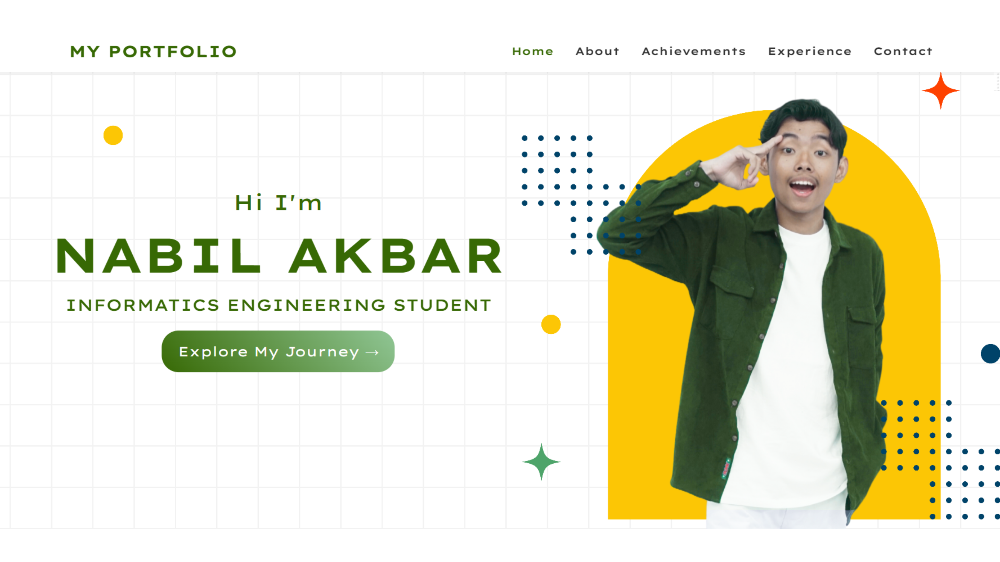
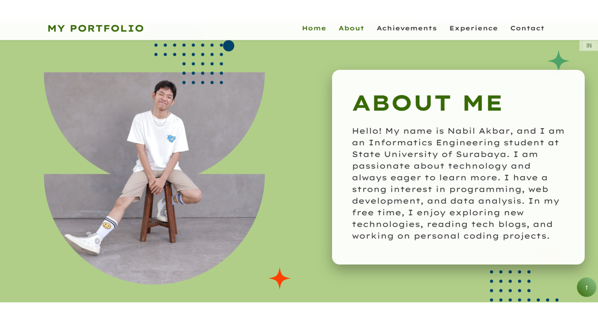
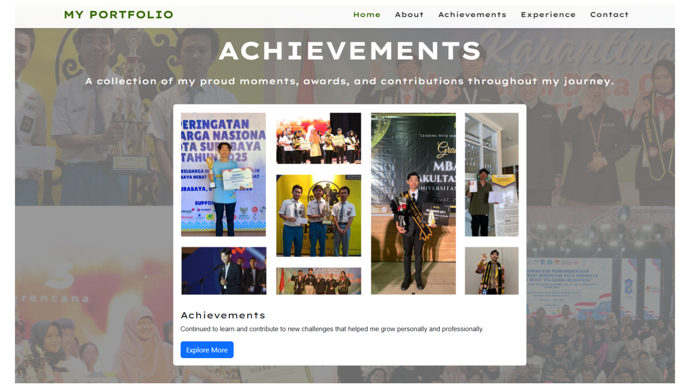
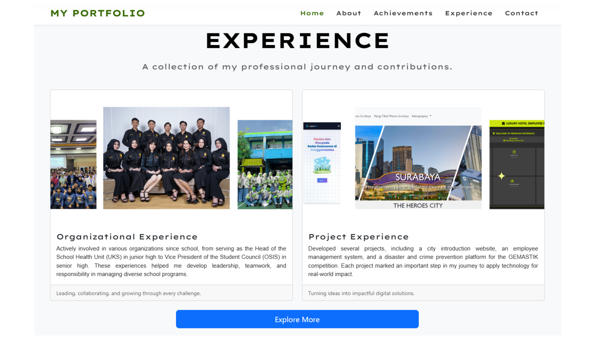
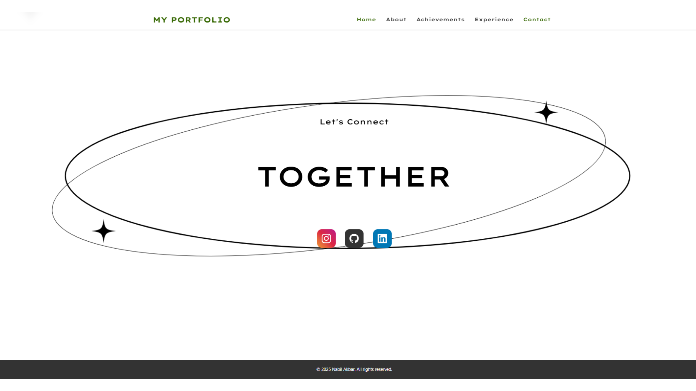
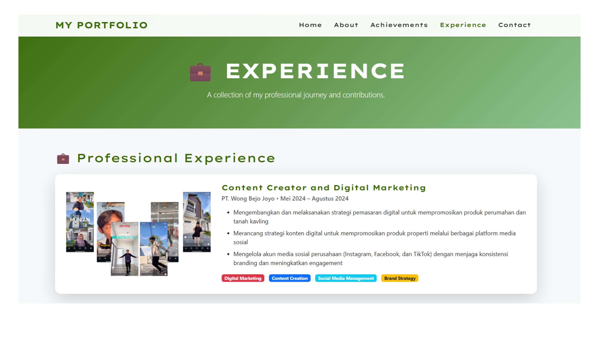
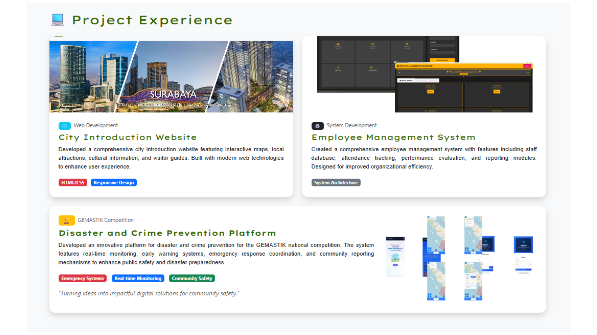

# 🌐 My Portfolio – Nabil Akbar  
**Kelas:** 2024C  
**NIM:** 24051204074  
**Mata Kuliah:** Pemrograman Berbasis Platform (PBP) – Semester Ganjil 2025/2026  
**Judul Proyek:** Website Portofolio Pribadi  

---

## 📖 Deskripsi Proyek  
Proyek ini adalah sebuah **website portofolio pribadi** yang menampilkan profil, pengalaman kerja, kegiatan organisasi, proyek, serta prestasi saya.  
Website ini dibuat sebagai bagian dari *Project MandiriForum* untuk menerapkan kemampuan dasar front-end web development menggunakan **HTML**, **CSS**, **Bootstrap**, dan **JavaScript**.  

Tujuan dari proyek ini adalah untuk menunjukkan pemahaman dalam membangun website statis yang terstruktur, memiliki desain yang menarik, serta memiliki elemen interaktif dasar.  

---

## 🛠️ Teknologi yang Digunakan  
- **HTML5** → Struktur dasar halaman  
- **CSS buatan sendiri** → Styling khusus pada header, footer, dan beberapa elemen card  
- **Bootstrap 5.3.8** → Framework CSS untuk layout responsif  
- **JavaScript dasar** → Menambahkan interaktivitas (animasi scroll, efek transisi, dll.)  

---

## 🗂️ Struktur Halaman  
Website ini terdiri dari beberapa halaman utama yang saling terhubung:  
- 🏠 **index.html** → Halaman utama (profil & kontak)  
- 🏆 **achievement.html** → Menampilkan berbagai prestasi  
- 💼 **experience.html** → Berisi pengalaman profesional, organisasi, proyek, dan kegiatan ambassador  

Tambahan file:  
- `style.css` → File CSS tambahan (custom style)  
- Folder `img/` → Menyimpan seluruh aset gambar  

---

## 🖼️ Screenshot (Preview)

Berikut beberapa tampilan dari website portofolio saya:

  

---

## 🔗 Link Proyek  
- 🌍 **Live Demo (Vercel):** [https://myportofolio-pied.vercel.app/](https://myportofolio-pied.vercel.app/)  
- 📁 **Source Code (GitHub):** [https://github.com/njhbil/myportofolio](https://github.com/njhbil/myportofolio)  
- 🎥 **Video Presentasi YouTube:** [https://youtu.be/f3FppGMS0M8](https://youtu.be/f3FppGMS0M8))  

---

## ✅ Checklist Pengerjaan  
- [x] Menggunakan HTML untuk struktur halaman  
- [x] Menggunakan CSS buatan sendiri  
- [x] Menggunakan framework CSS (Bootstrap)  
- [x] Menambahkan JavaScript interaktif  
- [x] Terdiri dari minimal 3 halaman web  
- [x] Diupload ke GitHub  
- [x] Dideploy ke Vercel  
- [ ] Upload video presentasi ke YouTube  

---

## 💡 Fitur Utama  
- Navigasi dinamis dengan efek highlight halaman aktif  
- Animasi *scroll reveal* menggunakan JavaScript (Intersection Observer)  
- Tampilan responsif dan modern  
- Struktur konten yang rapi dan mudah dibaca  
- Tampilan konsisten dengan palet warna hijau alami dan putih bersih  

---

## 👤 Tentang Saya  
**Nama:** Nabil Akbar  
**NIM:** 24051204074  
**Kelas:** 2024A  
**Email:** *(tambahkan jika ingin)*  
**LinkedIn:** [linkedin.com/in/nabil-akbar-a8991a326](https://www.linkedin.com/in/nabil-akbar-a8991a326/)  
**GitHub:** [github.com/njhbil](https://github.com/njhbil)  

---

Terima kasih telah mengunjungi portofolio saya!  
✨ *“Turning ideas into impactful digital solutions.”* ✨
